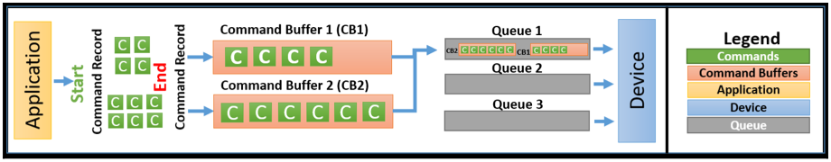

# vulkan执行中涉及的几个组件
## Device
为了渲染图形，计算机中必须有显卡，或者独立显卡或者集成显卡，这些都是`PhysicalDeivce`，而在vulkan的术语环境下，这个`PhysicalDeivce`指的是支持vulkan的具体的物理设备。

同样地，为了在各种应用中表示该`PhysicalDevice`，vulkan中引入`Device`的概念，它是一个抽象的logical representation。

对于在应用中使用时，对于vulkan兼容的`PhysicalDeivce`（指的是通过vulkan的API可以操作该设备），我们要find；对于`Device`，我们要create。

## Queue

`Queue`在数据结构中是先入先出的特性。根据这一点，在很多的消息队列中广泛使用，比如：生产者-消费者模型，尤其是多线程的环境下。如果你了解这一点，对于vulkan中`Queue`发挥的作用，就不会陌生了。

在vulkan中，`Queue`是execution engine和application之间的interface：
- application是command的生产者；
- execution engine是command的消费者；

具体来说，`Queue`的责任在于收集所有来自应用的commands,application将command提交到`Queue`，然后execution engine取走调度执行。

一个`PhysicalDevice`包含很多的`Queue`，每个`Queue`可能有不同的功能，这里的功能不同，我理解是：特定的`Queue`只能接受特定的command，比如：内存操作、并行计算等。

### Family
按照功能不同，这些`Queue`并划分到`Family`，这样一组`Queue`内形成的`Family`内，支持多种功能的`Queue`：
- video decode；
- video encode；
- graphics（重点使用）；
- compute（并行计算，深度学习模型等）；
- transfer；
- sparse memory management；

## Command

`Command`即application发出的，用来命令GPU执行的操作指令。一般可以分为3种类型：
- action

  这是真正要工作的`Command`，利用GPU等绘制图形，拷贝buffer等。

- state

  这种类型的`command`，是用来对一些状态进行管理的，比如一些descriptor sets、buffers等。
  > 对descriptor sets、buffers等不了解很正常，提一下，后续会深入学习，学一个东西总是不断有新的名词冒出来，开始时很恼火，不过后来就习惯了。

- synchronization
  
  这种command更多的是用来协调各种`Action command`，尤其是这些command对一些公共资源竞争时，或者彼此之间存在依赖关系，需要对它们进行排布，以更好地完成工作。

### Command buffer

- a collection of commands
- records the commands and submit them to queues

# vulkan执行模型

## 简要过程

vulkan中简要的执行过程如下图所示：

1. application选择支持vulkan API的`PhysicalDevice`；
2. application创建`Device`来代表选择的`PhysicalDevice`；
3. 根据自己的需求，选择`PhysicalDevice`中包含的特定`Queue`；
4. application发出的`Command`被记录在`Command Buffer`中；
5. 之后，这些`Command buffer`被提交到`Queue`中；
6. `PhysicalDevice`消费这些command，命令GPU执行对应的操作；
7. 最后，`PhysicalDevice`将处理的结果显示到屏幕上，或者返回给application。

## 一些注意事项

### command buffer construction is expensive

在这个过程中，`command buffer`要接受application提交的`command`，之后再submit给对应的`queue`。但是`command buffer`的构造是昂贵的，这里中的昂贵一般指时间占用或者资源使用上的，因此要缓存下来重用。而且，很多的`command buffer`可以通过多线程并发构造。

### application是execution顺利进行的主要责任人

在之前说到Vulkan与OpenGL等的一个重要的不同在于——驱动的很大一部分工作交给了application完成，具体有：
- 为`command`的顺利执行准备必要的条件；
  - prepare resources
  - precompile shaders
  - attach the resources to shaders
  - specify render states
  - build a pipeline
  - call draw operations
- memory management
- synchronization
  - 在不同的`queue`之间同步；
- Error checking

### Queue的实际执行过程

作为`command buffer`和`PhysicalDevice`的中介，负责沟通application和实际的GPU，`Queue`的实际执行过程影响了GPU的执行。

对于记录到`command buffer`中的一系列`command`，可以提交到：
- single queue

  对于提交到一个queue的多个`command buffer`，它们后续执行的顺序与它们提交的顺序保持一致，严格恪守先入先出的规则；

- multiple queue

  但是当多个`command buffer`同时提交到多个`queue`时，它们的执行顺序默认情况下，是没有保证的。如果application想要控制它们的执行顺序，需要自己完成同步的操作。

Vulkan中有多种保证同步的primitives，可以保证一个或者多个`queue`中`command buffer`的执行顺序：
- Semaphore
- Events
- Fences
- Pipeline barriers

这些同步机制在后续的学习中可能会有深入地阐述。