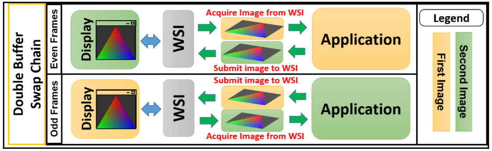

# vulkan application都需要什么

要完成一个Vulkan API编写的应用，需要哪些东西呢？如下图所示。

1. 首先，你需要一个**支持Vulkan的GPU**，否则无法运行应用；
2. 其次，你需要**Vulkan Driver**，这个不需要单独安装，一般和GPU一起绑定出厂；
3. 第三，为了写一个application，你需要**一套Vulkan SDK**；
4. 之后，写完的application需要运行**SPIR-V格式的shader**；
5. 最后，application得到的结果，需要显示在屏幕上，你需要**Windows System Integration**。

## 具体描述

### Driver

驱动是沟通application和GPU的中介，在application执行中，可以通过driver来查询GPU有多少可用的`PhysicalDevice`，每个`Device`中有多少个`Queue`，每个`Queue`具体什么功能。

Vulkan只是提供了一个统一的API，其具体的实现由各个硬件厂家完成，而这些厂家一般将驱动和对应的GPU绑定出厂，而驱动的功能和能效也是竞争力所在。

### Application

由开发人员负责提供，用于执行图形渲染或者并发计算等任务。Vulkan programming model规范地说明了一个Vulkan application的一般化操作，下边会详述。

### Vulkan SDK

用于支持Vulkan application的一系列工具，类似Java中的JDK。

### SPIR-V

在GPU中通过可编程的shader来完成各种顶点计算、着色等操作，Vulkan中的shader是[SPIR-V格式](https://www.khronos.org/spir/)的——a precompiled binary format。这种形式的最大好处是在运行时不用编译了，提高了执行的效率，而且SDK中提供了compiler，可以将多种shader语言编写成SPIR-V的格式，如：[GLSL](https://www.khronos.org/opengl/wiki/Core_Language_(GLSL))、HLSL等。

### WSI

Vulkan application的结果不一定要展现在屏幕上，比如并行计算的结果，即便是对于图形渲染的结果也不是强制的，但是为了方便开发，显现在屏幕上还是有很多的需求。但是Vulkan官方的规范中没有明确提出与window system交互，而是通过extension来实现的。`Windows System Integration`就是来自Khronos的一系列extensions，统一了对于Linux、Windows和Android等屏幕的呈现功能。

# Vulkan programming model

什么是编程模型，“模型”肯定是对一系列事务的共性的描述，那编程模型，可以理解为对于编程这件事的共性的描述。编程模型之前可以添加很多的定语，来描述“什么样的编程”的共性，例如：有事件驱动的编程模型等。

那么这里，就容易理解了——要说的是，通过vulkan API进行编程的共性的描述。也就是使用Vulkan API编程，不管是复杂还是简单，你一般都需要干哪些事情，具体应该怎么干。

Vulkan programming model整体结构如下：

## Hardware Initialization
在application开始正常运行之前，首先需要初始化硬件。**所谓初始化硬件，需要找到操作GPU的driver，这个操作是通过定位loader来实现的**。

[Vulkan loader的文档](https://github.com/KhronosGroup/Vulkan-Loader)中说到：
> The ICD loader is a library that is placed between a Vulkan application and any number of Vulkan drivers, in order to support multiple drivers and the instance-level functionality that works across these drivers. Additionally, the loader manages inserting Vulkan layer libraries, such as validation layers, between an application and the drivers.

简单说：
- loader是一个代码组件，主要任务是在application启动时去查找GPU对应的driver；
- loader加载driver的方式在各个平台中是一致的。
    - 前面提到，在Vulkan中保证所有操作在所有平台都是一致的，不一致的地方通过extension的方式支持；

这个loader会还会完成哪些工作呢？在[loader中存在一个layered architecture](https://github.com/KhronosGroup/Vulkan-Loader/blob/master/docs/LoaderInterfaceArchitecture.md#overview)。如下图所示：

对于不希望在vulkan API中实现的功能，可以通过在这里加一个layer来实现，以实现与vulkan driver的解耦，当需要这些功能时就打开（开发阶段），不需要就关闭（发布阶段）。具体包括以下功能：

- Error & Validation for debugging purpose
  
  在vulkan中，各种调试工作是通过validation layer实现的，不是vulkan core API的一部分，因此此时不需要找到vulkan driver。如[Validation layers](https://vulkan-tutorial.com/Drawing_a_triangle/Setup/Validation_layers)所述。

- Tracing vulkan API commands

一旦loader找到对应的driver并且成功建立链接，后续application需要逐步完成：
- create vulkan instance

  在vulkan中没有类似[OpenGL的global state](https://softwareengineering.stackexchange.com/questions/380832/opengl-and-global-state)，而是每个application都有自己的state，存储在`VkInstance`中，之后通过该对象初始化vulkan API，将application自身的信息传递出去。

- query physical devices for available queues
- query extensions and store them as function pointers

  如WSI (Window System Integration) extensions等。
- enable an injectable layer for error checking, debugging

## Windowing Presentation Surface

在完成driver的加载后，需要完成绘制任务，为了将绘制的结果显示在屏幕上，需要完成两件事：

1. perform the drawing task to build an image
2. put the image on the presentation window

这两个任务都是与具体的平台密切相关的，但是在vulkan的设计哲学中，所有的API都尽量与平台解耦，以统一的方式提供。而且，Vulkan本身不直接提供关于window创建相关的API，而是通过extension的方式支持，因此这2个任务通过[Window System Integration（WSI）](https://registry.khronos.org/vulkan/specs/1.3-extensions/html/chap33.html)完成：

- WSI中使用统一的API来创建window并且显示image，隐藏了技术细节，同时支持跨平台的功能。

- WSI还支持[swap chain机制](https://en.wikipedia.org/wiki/Swap_chain)，这种机制本质上是一个[images的队列](https://vulkan-tutorial.com/Drawing_a_triangle/Presentation/Swap_chain)，当在屏幕上显示一张图像时，application可以处理下一张图像。
  > Vulkan does not have the concept of a "default framebuffer", hence it requires an infrastructure that will own the buffers we will render to before we visualize them on the screen. This infrastructure is known as the **swap chain** and must be created explicitly in Vulkan. **The swap chain is essentially a queue of images that are waiting to be presented to the screen**.

WSI作为Display和application之间的interface，在两者之间不断交换image，保证image轮转地在两者之间被处理。如下图所示：

总的来说，此时通过WSI需要完成如下任务：
- 通过调用本地的API实现创建一个window；
- 创建一个WSI Surface 附着到这个window上；
  > `VK_KHR_surface` exposes a `VkSurfaceKHR` object that represents an abstract type of **[surface](https://vulkan-tutorial.com/Drawing_a_triangle/Presentation/Window_surface)** to present rendered images to.

- 创建一个swapchain以便将image呈现到surface
- 向创建的swapchain请求已经绘制的image

整个层次结构如下所示：

## Resource Setup

**资源设置是什么意思？其本质很简单，就是存储vulkan应用的数据到内存空间中**，以便在后续的程序中可以使用。**在我们的语境下，所谓资源一般是指内存资源**。

这里又要对比OpenGL和vulkan的区别了，OpenGL使用隐式的内存管理，而vulkan提供了low-level的API来操作底层的内存管理。在physical device中，vulkan提供了不同类型的内存，从而可以方便且显式地管理这些内存。

### 内存资源的类型

> 这里有疑问，所谓多种类型的memory是什么意思？memory不是一个统一的DDR吗？原因在于划分标准不同，按照性能和位置进行划分。

在Vulkan中内存可以分为两种类型：

- host local

  内存访问比较慢。

  - host local, device visible

    指的是host自己的内存资源，但是能被device访问。

- device local

  这种内存在physical device中，具有高带宽的特点，比较快。

  这种类型的内存可以进一步划分为：

    - device local, host not visible
    - device local, host visible

### 资源的管理过程

1. 创建resource objects

    这里要明确resource objects这个概念，我的理解是占据内存的是哪种类型的objects，比如用来存储images的内存，和用来存储buffer objects的内存。application负责为这些resource objects分配内存资源。

2. allocation & suballocation

	当这些resource objects被创建后，它们只知道内存的virtual address，还不知道physical address，也就无法实际访问内存空间。而之后，application负责分配内存，并将这些virtual address绑定到physical address中，如[文章](https://lifehit.cn/2022/10/29/ji-suan-ji-ji-chu/virtual-memory-1-jian-jie/)所述。

  	这里要注意一个问题，allocation是个expensive task，尽量不用多用，代替以suballocation，具体行为是，一次申请一大块内存空间，之后不再申请，而是将不同的resource objects放入到该内存空间中的各个小块。如下图所示：

	

3. sparse memory的支持

	vulkan支持sparse memory。对于一个很大的object，例如image object，其超过了当前分配给其的内存空间，因此可以对其进行切分，分成很多的小块，存储到很多的小内存空间中，当application要使用该object时，根据放置这些小块时记录的映射关系，再加载回来，这个过程对于application是不可知的。

	> 基于sparse memory的方法，我的理解是会影响效率，写入时切分小块，读出时再组合，有额外的工作。其需要至少保存两类信息，与切分后各个小块的映射关系，各个小块之间的依赖关系。

4. 使用staging buffer作为数据中转站

	如果要将vertex等data放到内存中，最简单的方法是直接放到CPU中，即host local，然后让GPU执行任务时去读取。但是，前面说到，这种类型memory很慢，当都需要读取大量数据时，受限于带宽，无法实现最优的性能，因此将数据放到device local才是最理想的方式。基于此，需要首先在CPU上构建staging buffer，将数据传输到这里，然后再将这些数据转移到device local中，[vulkan-tutorial中有讲这个过程](https://vulkan-tutorial.com/Vertex_buffers/Vertex_input_description)。

5. 异步传输数据

	完成了数据通道的构建，之后使用异步命令在graphic、DMA/tranfer queues中实现数据的传输。

### 总结

资源管理的流程可以总结如下：

1. create resource objects
2. query the appropriate memory instance and create memory objects

	简单说就是，将申请一块大内存，并将其切分为小块，分配给各个resource objects。

3. get memory requirements for the allocation.

	分配的内存资源是否足够，要使用sparse memory机制吗？

4. allocate space and store data in it
5. bind the memory with the created resource objects

## Pipeline Setup

> a pipeline is a set of events that occur in a fixed sequence defined by the applcaition logic.

这部分的工作包括：

1. supply the shaders
2. bind the shaders to the resource allocated in **resource setup**
3. manage the states of the pipeline

### descriptor sets

descriptor set是shaders和resources之间的桥梁，shaders通过descriptor sets实现对于resources的访问和使用。

descriptor sets有一系列特性：

- frequent change

	descriptor sets中存储了很多属性信息，类似关于texture等的，其数据变化的很频繁，而频繁地刷新descriptor sets是一项expensive task，极大地影响vulkan的性能。基于此，vulkan将descriptor sets在逻辑上划分为几个levels：

	- scene : low frequecy udpate  
	- model : medium frequecy udpate
	- draw : high frequency update

	这确保，对于draw level的高频更新不会影响scene等低频中descriptor sets对应的资源。

- multithread scalability

	允许多个线程同时更新descriptor sets中的数据。

- allocation mechnism

	descriptor sets是从descriptor pool中分配的，descriptor pool中维护了很多的descriptors，这些descriptor sets的同步由descriptor pool负责。

### shaders with SPIR-V

在vulkan中指定shader的方式只有通过SPIR-V这一种，但是具有如下特点：

- various source languages

	支持使用多种language编写human-reabable shaders，如：GLSL、HLSL，并使用LunarG提供的compiler编译成SPIR-V格式。

- offline compilation

	vulkan中的shaders都是预先编译好的，不会在程序运行期间编译，提高了效率。

### Pipeline state management

#### pipeline state是什么？

> A physical device contains a range of hardware settings that determine how the submitted input data of a given geometry needs to be interpreted and drawn. These settings are collectively called pipeline states.

状态可以分为2种类型：

- dynamic
- static

#### state能干什么

这些state决定了创建哪种pipeline object（graphics/compute），而创建pipeline object是一个expensive task，最好只创建一次并且重用。

> 为啥expensive？The VkPipeline is a huge object in Vulkan that encompasses the configuration of the entire GPU for the draw. Building them can be very expensive, as it will fully convert the shader module into the GPU instructions, and will validate the setup for it. 引自[这里](https://vkguide.dev/docs/chapter-2/pipeline_walkthrough/)。具体来说，包括对shader重新编译，并将这些shader绑定到对应的resource上等工作。

根据不同的状态变量及其取值，可以组合成百上千种pipeline objects

pipeline object和pipeline cache object(PCO)、pipeline layout一起控制pipeline state：

- pipeline cache object

	因为pipeline的创建是expensive，因此一旦被创建，就会被cached。这样，当需要创建一个新的pipeline object时，就会寻找最接近的PCO，然后基于此base pipeline创建新的pipeline object。

	需要说明的是，PCO可以提供性能，但是，这需要application负责持久化该cache对象，并在创建新的pipeline object时，匹配合适的PCO。

- pipeline layout

	该对象描述了给定一个pipeline object，shaders的输入信息是什么样的。具体来说，就是通过descriptor sets，将resources绑定到shaders的binding slot来建立映射关系，以便后续shaders能够读取相应的数据，完成drawing tasks。

#### 总结

这个阶段，我们完成了：

1. shaders are compiled into SPIR-V forms and specified in the pipeline shader state.

2. descirptor sets connect resources to shaders.
3. application creates pipeline objects from PCO for better peformance.

## Command Recordings

这一步就是收集各个commands，构建command buffer的过程，以便后续提交到queue中。

### 具体过程

为了记录application提交的commands，需要将它们包裹在一定的范围内，如下图是一个drawing command buffer被记录的描述：

简要介绍一下，如果完成command recording：

> 这个过程是一般化的，具体的场景可能会有变化。

- `scope`

  指定command buffer recordings的开始和结束所框定的范围。

- `Render Pass`

  指定了任务的执行具体过程。

  > 对于render pass这个概念，一直比较迷糊，Vulkan spec中也没有细讲，可以参考下述的资料：
  - https://developer.samsung.com/galaxy-gamedev/resources/articles/renderpasses.html

  - https://vulkan-tutorial.com/Drawing_a_triangle/Graphics_pipeline_basics/Render_passes#page_Render-pass

  - https://vkguide.dev/docs/chapter-1/vulkan_renderpass/

  一个比较清晰的描述如下：

  > A VkRenderPass is a Vulkan object that encapsulates the state needed to setup the “target” for rendering, and the state of the images you will be rendering to.

  > The renderpass is a concept that only exists in Vulkan. It’s there because it allows the driver to know more about the state of the images you render.

- `Pipeline`

  通过pipeline object指定各种状态信息。

- `descriptor`

  将内存资源与shaders建立联系，以便后续的数据的读写。

- `Bind resource`

  指定各种需要的数据，比如vertex buffer、images等，这些在执行任务时都要用到。

- `Viewport`

  确定了要进行rendering的surface，可以查看上面WSI部分那个图。

- `Scissor`

  定义了一个矩形区域，超过这个区域的内容不会被渲染。

- `Draw`

  具体的draw command，需要指定geometry buffer相关的属性信息，完成任务。

### 性能考虑

创建command buffer是一个expensive task，因此，Vulkan支持使用多线程的方式来创建command buffer，而且为了不因并发产生资源竞争，采用了command buffer pool的方式，如下：

每个单独的线程对应一个command buffer pool，既可以重用command buffer，又不担心资源竞争。

## Queue Submission

当上述的command buffer构建成功后，就被提交到queue中进行处理。vulkan中有不同类型的queue，根据job的不同属性，可以选择不同类型的queue。

- 对于compute任务，需要提交到compute queue；
- 对于graphics任务，需要提交到graphics queue；

这些提交的job以异步的方式执行，如果希望进行同步，需要application显式管理。

具体来说，这一阶段完成了：

- 从sawpchain中获取下一个需要被draw的frame；
- application设置各种同步机制，以便协调不同commands；
- 将收集的command记录到command buffer中，并提交到特定的queue中；
- 请求将绘制完成的images展现到output device中；

# 参考资料

1. https://vulkan-tutorial.com/Drawing_a_triangle/Graphics_pipeline_basics/Shader_modules
2. https://vulkan-tutorial.com/Drawing_a_triangle/Presentation/Window_surface
3. Learning Vulkan - Chapter 1 - Understanding the Vulkan application & Getting started with the Vulkan programming model
4. https://registry.khronos.org/vulkan/specs/1.3-extensions/html/chap4.html
